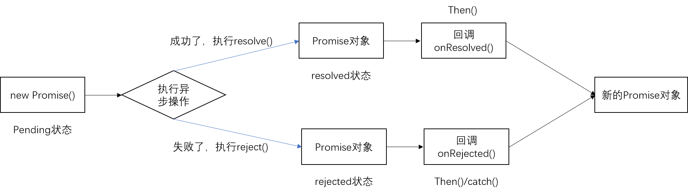

## 1.Promise基本介绍与使用

### 01 异步编程

- fs 文件操作
- 数据库操作
- Ajax
- 定时器

### 02 Promise支持链式调用，可以解决回调地狱问题

1.什么是回调地狱？

回调函数嵌套调用，外部回调函数异步执行的结果是嵌套的回调执行的条件

2.回调地狱的缺点？

不便于阅读

不便于异常处理

3.解决方案？

Promise 链式调用

### 03 util.promisify方法

```javascript
// 引入util模块
const util = require('util')
// 引入fs模块
const fs = require('fs')
// 返回一个新的函数
let mineReadFile = util.promisify(fs.readFile)

mineReadFile('./test.txt').then(res => {
  console.log(res.toString());
}).catch(err => {
  console.log(err);
})
```

### 04 Promise 封装Aiax请求

```javascript
function sendAjax(url) {
  return new Promise((resolve, reject) => {
    const xhr = new XMLHttpRequest();
    xhr.open('GET', url)
    xhr.send()
    // 处理结果
    xhr.onreadystatechange = function () {
      if (xhr.readyState === 4) {
        // 判断成功
        if (xhr.status >= 200 && xhr.status < 300) {
          // 成功的结果
          resolve(xhr.response)
        } else {
          // 失败的结果
          reject(xhr.status)
        }
      }
    }
  })
}
sendAjax('https://api.apiopen.top/getJoke').then(res => {
  console.log(res);
}, err => {
  console.log(err);
})
```

### 05 Promise的状态

```
是Promise实例对象的一个属性 叫PromiseState
有三种可能值
	*pending(未决定的；行将发生的)
	*resolved/fulfilled
	*rejected
```

```
Promise的状态改变
1.pending 变为 resolved
2.pending 变为 rejected
说明：只有这两种，且一个Promise对象只能改变一次
	无论变为成功还是失败，都会有一个结果数据
	成功的结果一般称为value，失败的结果一般称为reason
```

### 05 Promise对象的值

```
实例对象中的另一个属性 PromiseResult
保存着异步任务 成功/失败的结果
resolve()
reject()
```

### 06 Promise工作流程



## 2.Promise API

### 01 Promise构造函数：Promise（excutor){}

```
1.excutor函数：执行器，（resolve，reject）=>{}
2.resolve函数：内部定义的成功时我们调用的函数，value=>{}
3.reject函数：内部定义失败时我们调用的函数reason=>{}
说明：excutor会在Promise内部立即同步调用，异步操作在执行器中执行
```

### 02 Promise.prototype.then 方法：（onResolved,onRejected)=>{}

```
1.onResolve函数：成功的回调函数value=>{}
2.onRejected函数：失败的回调函数 reason=>{}
说明：指定一个用于得到成功value的成功回调和用于失败reason的失败回调
返回一个新的Promise对象
```

### 03 Promise.prototype.catch方法：（onRejected)=>{}

```
onRejected函数：失败的回调函数：reason=>{}
```

### 04 Promise.resolve方法：value=>{}

```
value：成功的数据或promise对象
说明：返回一个成功/失败的promise对象
```

```
如果传入的参数为 非Promise类型的对象，则返回的结果为成功的Promise对象
如果传入的参数为 Promise对象，则参数的结果决定了resolve的结果
```

### 05 Promise.reject方法：reason=>{}

```
reason：失败的原因
说明：返回一个失败的promise对象
```

### 06 Promise.all 方法：（promises)=>{}

```
promises:包含n个promise的数组
说明：返回一个新的promise，只有所有的promise都成功才成功，只要有一个失败就直接失败
```

### 07 Promise.race方法：（promises)=>{}

```
promises:包含n个promise的数组
说明：返回一个新的promise，第一个完成的promise的结果状态就是最终的结果状态
```

## 3.Promise关键问题

### 01 如何改变promise的状态

```
1.resolve(value):如果当前是pending，就会变成resolved
2.reject(reason):如果当前是pending就会变成rejected
3.抛出异常：如果当前是pending就会变成rejected
```

### 02 一个promise指定多个成功/失败的回调，都会调用嘛？

```javascript
// 当promise改变为对应状态时都会调用
let p = new Promise((resolve,reject)=>{
	resolve()
})
p.then(value=>{
    console.log(value)
})
p.then(value=>{
    console.log(value)
})
// 都会执行
```

### 03 改变promise状态和指定回调函数谁先谁后?

```
1.都有可能，正常情况下是先指定回调，在改变状态，但也可以先改变状态，再执行回调
2.如何先改变状态，再执行回调
	1）在执行器中直接调用resolve()/reject()
	2)延迟更长时间才调用then()
3.什么时候才能得到数据？
	1.如果先指定回调，当状态发生改变时，回调函数就会调用，得到数据
	2.如果先改变状态，当指定回调时，回调函数就会调用，得到数据
```

### 04.promise.the()返回的新 promise的结果状态由什么决定?

```
(1)简单表达: 由 then()指定的回调函数执行的结果决定
(2详细表达:
    如果抛出异常，新promise变为rejected, reason为抛出的异常
    如果返回的是非promise的任意值，新 promise变为resolved, value为返回的值
    如果返回的是另一个新promise，此promise的结果就会成为新promise 的结果
```

### 05.promise 如何串连多个操作任务?

```
(1) promise 的 then()返回一个新的 promise，可以开成then()的链式调用
(2通过 then 的链式调用串连多个同步/异步任务
```

### 06 Promise异常穿透?

```
1.当使用Promise的then链式调用时，可以在最后指定失败的回调
2.前面任何操作出了异常，都会传到最后失败的回调中处理
```

### 07 中断Promise链?

```
1.当使用promise的then链式调用时，在中间中断，不在调用后面的回调函数
2.办法：在回调函数中返回一个pending状态的promise对象
```


## 4.Promise自定义封装

### 01 定义整体结构

```javascript
function MyPromise(executor) {

}
// 添加then方法
MyPromise.prototype.then = function (onResolved, onRejected) {

}
```

### 02 resolve和reject结构搭建

```javascript
  // resolve函数
  function resolve(data) {
    
  }
  // reject函数
  function reject(data) {
    
  }
  // 同步调用【执行器函数】
  executor(resolve,reject);

```

### 03 resolve和reject代码实现

```javascript
// 添加属性
  this.PromiseState = 'pending';
  this.PromiseResult = null;
  // 保存实例对象的this值
  const self = this
  // resolve函数
  function resolve(data) {
    // 1.修改对象的状态(PromiseState)
    self.PromiseState = 'fulfilled';
    // 2.修改对象的结果值(PromiseResult)
    self.PromiseResult = data;
  }
  // reject函数
  function reject(data) {
    // 1.修改对象的状态(PromiseState)
    self.PromiseState = 'rejected';
    // 2.修改对象的结果值(PromiseResult)
    self.PromiseResult = data;
  }
```

### 04 throw抛出异常修改对象状态

```javascript
  try {
    // 同步调用【执行器函数】
    executor(resolve, reject);
  } catch (error) {
    // 修改promise对象值为失败
    reject(error)
  }
```

### 05 promise对象状态只能改变一次

```javascript
    // 判断状态
    if (self.PromiseState !== 'pending') return;
```

### 06 then方法执行回调

```javascript
MyPromise.prototype.then = function (onResolved, onRejected) {
  // 调用回调函数
  if (this.PromiseState === 'fulfilled') {
    onResolved(this.PromiseResult)
  }
  if (this.PromiseState === 'rejected') {
    onRejected(this.PromiseResult)
  }
}
```

### 07 异步任务回调的执行

```javascript
    // 添加回调函数属性
  this.callback = {};
  
  if (this.PromiseState === 'pending') {
    // 保存回调函数
    this.callback = {
      onResolved,
      onRejected
    }
  }
      // 调用成功的回调函数
    if (self.callback.onResolved) {
      self.callback.onResolved(data)
    }
        // 调用失败的回调函数
    if (self.callback.onRejected) {
      self.callback.onRejected(data)
    }
```

### 08 指定多个回调

```javascript
    // 保存回调函数
    this.callbacks.push({
      onResolved,
      onRejected
    })
    self.callbacks.forEach(item => {
      item.onRejected(data)
    })
```

### 09 同步修改状态then方法结果返回

```

```


## 5.async与await

### 02 await 表达式

```
1. await右侧的表达式一般为promise对象，但也可以是其它的值
2．如果表达式是promise对象, await 返回的是promise成功的值
3.如果表达式是其它值，直接将此值作为await的返回值
```

```
注意
1.await必须写在async函数中，但是async函数中可以没有await
2.如果await的promise失败了，就会抛出异常，需要通过try..catch 捕获处理
```

```javascript
async function main(){
	let p = new Promise((resolve,reject)=>{
        resolve('ok')
        reject('Error')
	})
    // 1.右侧为promise成功的情况
    let res = await p;
    // 2.右侧为其他类型的数据
    let res2 = await 20;
    // 3.右侧为promise失败的情况
    try {
        let res3 = await p;
    } catch(e){
        console.log(e)
    }
}
```

### 03 async与await结合

```javascript
/**
 * util.promisify 方法
 */
// 引入util模块
const util = require('util')
// 引入fs模块
const fs = require('fs')
// 返回一个新的函数
let mineReadFile = util.promisify(fs.readFile)

async function readFiles() {
  try {
    let data = await mineReadFile('./test.txt')
    console.log(data.toString());
  } catch (error) {
    console.log(err);
  }
}
readFiles()
```